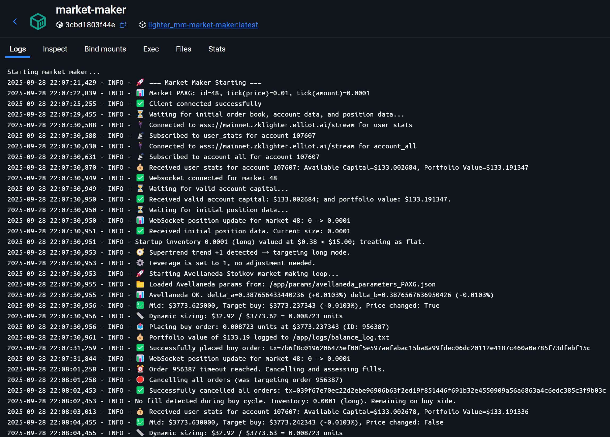

# Lighter DEX Market Maker

This repository is a Python market-making system for the Lighter DEX. It has two core components:
1. Data Collector (`gather_lighter_data.py`): streams order book and trades to `lighter_data/` as Parquet.
2. Market Maker (`market_maker_v2.py`): places and manages two-sided limit orders on Lighter using a volatility + order-book imbalance (vol_obi) spread model.

By default, the market maker uses 12% of available balance per order (see `CAPITAL_USAGE_PERCENT` in `market_maker_v2.py`).

Affiliate link to Support this project : ⚡Trade on Lighter – Spot & Perpetuals, 100% decentralized, no KYC, and ZERO fees – [https://app.lighter.xyz/?referral=FREQTRADE](https://app.lighter.xyz/?referral=FREQTRADE) (I'll give you 100% kickback with this link)

## Quick Start

### Prerequisites
- Python 3.10+
- Docker and Docker Compose (optional)

### Installation
```bash
pip install -r requirements.txt
```

### Configuration
1. Create `.env` from `.env.example` and fill in your credentials.
2. Edit `config.json` to set `CRYPTO_TICKERS`.

### Environment variables

**Required for trading:**
| Variable | Default | Description |
|---|---|---|
| `API_KEY_PRIVATE_KEY` | — | Lighter API private key |
| `ACCOUNT_INDEX` | `0` | Lighter account index |
| `API_KEY_INDEX` | `0` | Lighter API key index |
| `MARKET_SYMBOL` | `BTC` | Market to trade. Can also be set via `--symbol`. |

**Trading parameters:**
| Variable | Default | Description |
|---|---|---|
| `LEVERAGE` | `1` | Leverage set at startup |
| `MARGIN_MODE` | `cross` | `cross` or `isolated` |
| `BASE_AMOUNT` | `0.047` | Fallback order size in base currency |
| `CAPITAL_USAGE_PERCENT` | `0.12` | Fraction of available balance per order |
| `SAFETY_MARGIN_PERCENT` | `0.01` | Safety haircut applied to available balance |
| `ORDER_TIMEOUT` | `0.5` | Seconds before a placement is considered timed out |
| `MINIMUM_SPREAD_PERCENT` | `0.005` | Minimum allowed spread (0.5%) |
| `POSITION_VALUE_THRESHOLD_USD` | `15.0` | USD position size below which the bot considers itself flat |
| `QUOTE_UPDATE_THRESHOLD_BPS` | `1.0` | Minimum price move (bps) before requoting |
| `MIN_LOOP_INTERVAL` | `0.1` | Minimum seconds between quoting loop iterations |
| `FLIP` | `false` | Reverse bid/ask sides (reserved, not actively used) |

**WebSocket tuning:**
| Variable | Default | Description |
|---|---|---|
| `WS_PING_INTERVAL` | `20` | WebSocket ping interval in seconds |
| `WS_RECV_TIMEOUT` | `30.0` | WebSocket receive timeout in seconds |
| `WS_RECONNECT_BASE_DELAY` | `5` | Base delay for exponential reconnect backoff |
| `WS_RECONNECT_MAX_DELAY` | `60` | Maximum reconnect backoff delay |

**Orderbook sanity check:**
| Variable | Default | Description |
|---|---|---|
| `SANITY_CHECK_INTERVAL` | `10` | Seconds between REST snapshot cross-checks |
| `SANITY_CHECK_TOLERANCE_PCT` | `0.5` | Allowed % drift before the book is considered stale |

**Safety controls:**
| Variable | Default | Description |
|---|---|---|
| `STALE_ORDER_POLLER_INTERVAL_SEC` | `3.0` | Seconds between active-order reconciliation polls |
| `STALE_ORDER_DEBOUNCE_COUNT` | `2` | Consecutive mismatches required before safety pause |
| `MAX_CONSECUTIVE_ORDER_REJECTIONS` | `5` | Rejection count that triggers the circuit breaker |
| `CIRCUIT_BREAKER_COOLDOWN_SEC` | `60.0` | Cooldown before trading can resume after pause |
| `ORDER_RECONCILE_TIMEOUT_SEC` | `2.0` | Timeout to confirm cancel before replacement order |
| `MAX_LIVE_ORDERS_PER_MARKET` | `2` | Safety threshold for max exchange open orders per market |

**vol_obi spread model:**
| Variable | Default | Description |
|---|---|---|
| `VOL_OBI_WINDOW_STEPS` | `6000` | Rolling window length in steps |
| `VOL_OBI_STEP_NS` | `100_000_000` | Step size in nanoseconds (100 ms) |
| `VOL_OBI_VOL_TO_HALF_SPREAD` | `0.8` | Multiplier mapping volatility to half-spread |
| `VOL_OBI_MIN_HALF_SPREAD_BPS` | `2.0` | Minimum half-spread in basis points |
| `VOL_OBI_C1_TICKS` | `160.0` | OBI skew coefficient in ticks |
| `VOL_OBI_C1` | `0.0` | OBI skew coefficient (raw price units, overrides ticks if non-zero) |
| `VOL_OBI_SKEW` | `1.0` | Global skew scaling factor |
| `VOL_OBI_LOOKING_DEPTH` | `0.025` | Fraction of book depth used for OBI calculation |
| `VOL_OBI_MIN_WARMUP_SAMPLES` | `100` | Minimum samples before live quoting begins |
| `VOL_OBI_MAX_POSITION_DOLLAR` | `500.0` | Dollar position cap for inventory skew |

**Binance alpha signal:**
| Variable | Default | Description |
|---|---|---|
| `ALPHA_SOURCE` | `binance` | Alpha signal source (`binance` or `none`) |
| `BINANCE_STALE_SECONDS` | `5.0` | Max age of Binance OBI before it is discarded |
| `BINANCE_OBI_WINDOW` | `300` | Rolling window size for Binance OBI |
| `BINANCE_OBI_MIN_SAMPLES` | `150` | Minimum samples before Binance signal is active |
| `BINANCE_OBI_LOOKING_DEPTH` | `0.025` | Fraction of Binance book depth used for OBI |

**Data / ops:**
| Variable | Default | Description |
|---|---|---|
| `PARQUET_MAX_MB` | `5` | Parquet part size for the data collector |
| `BUFFER_SECONDS` | `5` | Flush interval for the data collector (`gather_lighter_data.py` only) |
| `HL_DATA_LOC` | `lighter_data` | Directory for recorded Parquet files (`utils.py`) |
| `LOG_DIR` | `logs` | Log directory |

**Config file precedence:** env var > `config.json` > hardcoded default.
`config.json` can override defaults for `trading.*`, `performance.*`, `websocket.*`, and `safety.*` sections (including all vol_obi and alpha sub-keys).

### Notes
- Use a dedicated account or sub-account and start with small amounts.
- The data collector only reads public market data and can run without credentials.
- To find your `ACCOUNT_INDEX`, query `https://mainnet.zklighter.elliot.ai/api/v1/accountsByL1Address?l1_address=0x...` with your L1 wallet address.

### Running with Docker
```bash
docker-compose build
docker-compose up -d
```
Only the data collector runs by default. Uncomment the `market-maker` service in `docker-compose.yml` when you are ready.

### Running scripts locally
```bash
python gather_lighter_data.py
python market_maker_v2.py --symbol BTC
```

### Tests
```bash
python test_runner.py
python check_parquet.py
python -m unittest discover -s tests -p "test_*.py"
```

## Example Output


## Project Structure
```
.
├── market_maker_v2.py        # Main market-making loop
├── gather_lighter_data.py    # Data collector (order book + trades → Parquet)
├── vol_obi.py                # VolObiCalculator and RollingStats spread model
├── binance_obi.py            # BinanceObiClient / SharedAlpha: external alpha signal
├── orderbook.py              # Shared order book update logic
├── orderbook_sanity.py       # Runtime WebSocket vs REST book cross-check
├── ws_manager.py             # Shared WebSocket subscription manager
├── utils.py                  # Shared helpers (Parquet I/O, config loading, …)
├── logging_config.py         # Centralized logging setup
├── adjust_leverage.py        # CLI tool to set leverage and margin mode
├── find_trend_lighter.py     # Offline trend analysis on recorded Parquet data
├── user_stats_subscriber.py  # Live portfolio / balance monitor
├── deploy.py                 # SCP + remote docker-compose restart
├── sync_files.py             # Incremental file sync to remote host
├── sync_paxg_files.py        # Incremental file sync (PAXG variant)
├── stop_remote.py            # Stop remote Docker stack
├── test_runner.py            # Test runner entry point
├── check_parquet.py          # Parquet file integrity checker
├── config.json               # Runtime config overrides
├── docker-compose.yml
├── Dockerfile
├── .dockerignore
├── requirements.txt
├── .env.example
├── COPY_AWS_COMMAND.txt      # Reference SCP command for AWS deployment
├── screen.png                # Example log screenshot
├── tests/                    # Unit tests
├── tests_live/               # Live integration tests
├── params/                   # Saved parameter sets
├── lighter_data/             # Recorded Parquet files (prices_*_part*.parquet, trades_*_part*.parquet)
├── logs/                     # Runtime logs
├── DOC/                      # Documentation assets
├── OLD/                      # Archived scripts
└── example_rust/             # Rust client example
```

## How It Works

### 1. Data Collection
`gather_lighter_data.py` subscribes to order book and trade channels for `CRYPTO_TICKERS` from `config.json`. It maintains a local order book, stores the top 10 levels, and flushes buffered data to compressed parquet parts in `lighter_data/`. File rotation is size-based via `PARQUET_MAX_MB`.

### 2. Market Making
`market_maker_v2.py` places two-sided limit orders on Lighter. Sizing uses:
```
base_amount = available_balance * CAPITAL_USAGE_PERCENT / mid_price
```
The size is rounded to tick size when available.

### 3. Spread Model — vol_obi.py
`vol_obi.py` provides two classes used by the market maker:
- **`RollingStats`** — maintains a fixed-length ring buffer of mid-price samples and computes rolling volatility in O(1) per step.
- **`VolObiCalculator`** — combines the rolling volatility estimate with an order-book imbalance (OBI) signal to produce a skewed bid/ask half-spread. The spread widens with volatility and shifts toward the heavier side of the book to manage inventory.

### 4. External Alpha — binance_obi.py
`binance_obi.py` runs a background WebSocket connection to Binance Futures and streams a real-time OBI signal that is used to bias the quotes before they are sent to Lighter.
- **`BinanceObiClient`** — subscribes to the Binance depth stream for the mapped symbol and maintains a local book.
- **`SharedAlpha`** — thread-safe container that the main loop reads; the Binance client writes into it. Signals older than `BINANCE_STALE_SECONDS` are discarded.
- Symbol mapping: `BTC → btcusdt`, `ETH → ethusdt`, `PAXG → paxgusdt`, `SOL → solusdt`.

### 5. Orderbook Sanity Check — orderbook_sanity.py
`orderbook_sanity.py` periodically fetches a REST snapshot of the Lighter order book and compares it against the local WebSocket-maintained copy. If the best bid or ask drifts beyond `SANITY_CHECK_TOLERANCE_PCT`, the book is flagged as stale and the market maker pauses quoting until a clean re-sync occurs. Checks run every `SANITY_CHECK_INTERVAL` seconds.

## Utility Scripts

### adjust_leverage.py
Sets leverage and margin mode on Lighter at startup or on demand:
```bash
python adjust_leverage.py --leverage 3 --margin-mode isolated
```

### user_stats_subscriber.py
Streams live portfolio statistics and account balances via WebSocket. Useful for monitoring a running bot without restarting it:
```bash
python user_stats_subscriber.py
```

### find_trend_lighter.py
Offline analysis tool that loads recorded Parquet data from `lighter_data/` and computes trend indicators. Run after collecting data to evaluate market conditions before tuning parameters:
```bash
python find_trend_lighter.py
```

## Deployment / Remote Ops

### deploy.py
Copies changed files to a remote host via SCP and restarts the Docker Compose stack:
```bash
python deploy.py
```

### sync_files.py / sync_paxg_files.py
Incrementally syncs local files to a remote host (rsync-style, using SCP). `sync_paxg_files.py` is a variant scoped to PAXG-related files:
```bash
python sync_files.py
python sync_paxg_files.py
```

### stop_remote.py
Sends a `docker-compose down` command to the remote host to stop the running stack:
```bash
python stop_remote.py
```

## Risk Warning
This trading software will likely lose money and is not competitive with professional firms. Always start with small amounts and understand the risks of automated trading.
